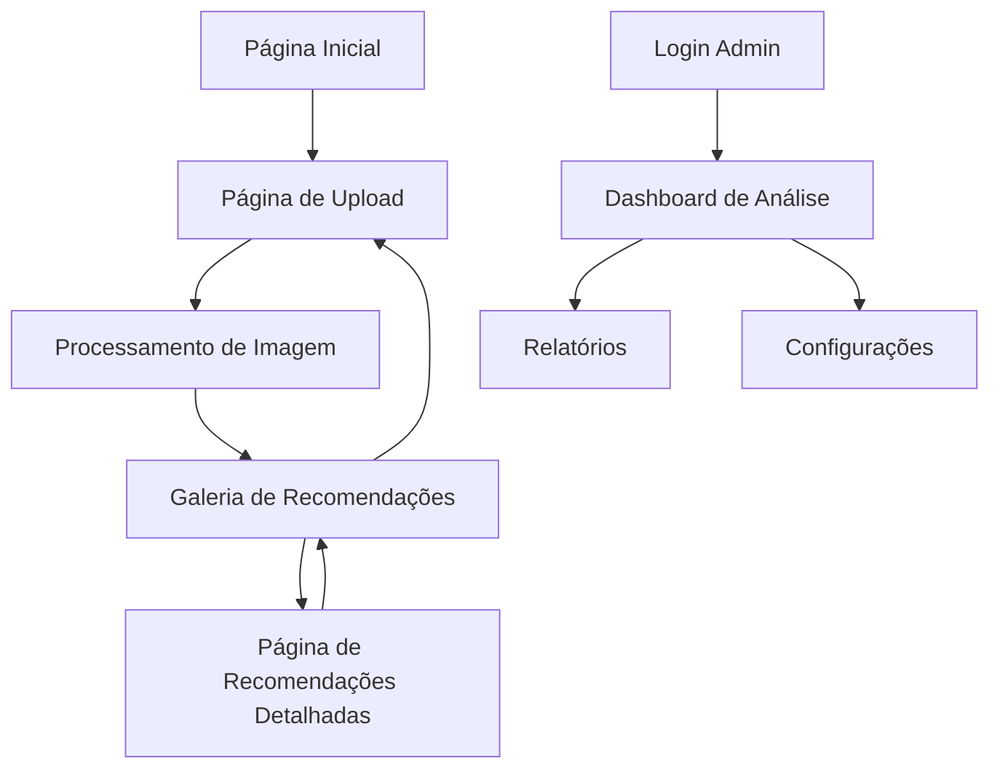

## 1. Visão Geral do Produto

Sistema web de recomendação de imagens que utiliza inteligência artificial para analisar características visuais e sugerir imagens similares. O produto permite upload de imagens, processamento automático de características visuais e apresentação de recomendações relevantes em interface intuitiva.

O sistema resolve o problema de encontrar imagens similares em grandes coleções, ajudando fotógrafos, designers e usuários comuns a descobrir conteúdo visual relacionado de forma automatizada.

## 2. Funcionalidades Principais

### 2.1 Páginas do Sistema

O sistema de recomendação de imagens consiste nas seguintes páginas principais:

1. **Página de Upload**: interface de upload de imagens, visualização de preview, confirmação de envio.
2. **Galeria de Imagens**: visualização em grid, filtros por categorias, paginação de resultados.
3. **Página de Recomendações**: exibição de imagens similares, pontuação de similaridade, navegação entre recomendações.
4. **Dashboard de Análise**: estatísticas de uso, histórico de uploads, performance do sistema.

### 2.2 Detalhamento das Funcionalidades

| Página | Módulo | Descrição das Funcionalidades |
|--------|--------|-------------------------------|
| Página de Upload | Área de Upload | Arrastar e soltar imagens, seleção manual de arquivos, validação de formato e tamanho |
| Página de Upload | Preview da Imagem | Visualização em tempo real, rotação e ajuste básico, confirmação antes do envio |
| Página de Upload | Processamento | Barra de progresso do upload, extração de features visuais, armazenamento seguro |
| Galeria de Imagens | Grid de Visualização | Layout responsivo em colunas, thumbnails otimizadas, carregamento sob demanda |
| Galeria de Imagens | Filtros e Busca | Filtros por cor, tema e data, busca textual por tags, ordenação por relevância |
| Galeria de Imagens | Interações | Clique para ampliar, seleção múltipla para comparação, download de imagens |
| Página de Recomendações | Análise de Similaridade | Cálculo de distância entre features, ranking por similaridade visual, limiar de confiança |
| Página de Recomendações | Exibição de Resultados | Grid de imagens similares, porcentagem de similaridade, opções de refinar busca |
| Dashboard de Análise | Estatísticas | Total de uploads por período, tempo médio de processamento, taxa de acerto das recomendações |
| Dashboard de Análise | Histórico | Timeline de uploads anteriores, análise de padrões de uso, exportação de relatórios |

## 3. Fluxo de Navegação

### Fluxo Principal do Usuário
1. Usuário acessa a página de upload e seleciona uma imagem
2. Sistema processa a imagem e extrai características visuais
3. Usuário é redirecionado para galeria com recomendações baseadas na imagem
4. Usuário pode explorar recomendações ou fazer novo upload

### Fluxo de Administração
1. Admin acessa dashboard com estatísticas do sistema
2. Visualiza performance e métricas de uso
3. Gerencia configurações do sistema
4. Exporta relatórios de análise

## 4. Design da Interface

### 4.1 Estilo Visual
- **Cores Primárias**: Azul tecnológico (#2563EB) e branco (#FFFFFF)
- **Cores Secundárias**: Cinza claro (#F3F4F6) e cinza escuro (#6B7280)
- **Botões**: Estilo moderno com bordas arredondadas, efeitos de hover suaves
- **Tipografia**: Fonte sans-serif moderna (Inter ou Roboto), tamanhos hierárquicos claros
- **Layout**: Card-based com sombras sutis, espaçamento generoso, grid responsivo
- **Ícones**: Estilo outline minimalista, consistência visual em todo o sistema

### 4.2 Elementos por Página

| Página | Módulo | Elementos de UI |
|--------|--------|-----------------|
| Página de Upload | Área de Upload | Dropzone grande com borda tracejada, ícone de nuvem, texto instrutivo claro |
| Página de Upload | Preview | Imagem centralizada, botões de ação flutuantes, indicador de progresso circular |
| Galeria de Imagens | Grid | Cards com proporção 4:3, overlay com informações ao hover, paginação infinita |
| Galeria de Imagens | Filtros | Sidebar colapsável, checkboxes para categorias, slider para ajuste de cores |
| Recomendações | Resultados | Cards destacando similaridade, badges com porcentagem, botão "Ver mais" |
| Dashboard | Gráficos | Gráficos de linha para tendências, barras para comparações, cards com KPIs |

### 4.3 Responsividade
- **Desktop-first**: Otimizado para telas grandes (1920px), adaptação progressiva
- **Mobile**: Menu hamburger, cards empilhados verticalmente, touch-friendly
- **Breakpoints**: 640px (mobile), 768px (tablet), 1024px (desktop), 1280px (wide)
- **Otimizações**: Imagens adaptativas, carregamento lazy, cache agressivo

## 5. Requisitos Técnicos

### 5.1 Requisitos de Performance
- Tempo de upload máximo: 30 segundos para imagens de 10MB
- Tempo de processamento: máximo 5 segundos por imagem
- Tempo de resposta para recomendações: máximo 2 segundos
- Suporte para até 1000 usuários simultâneos

### 5.2 Requisitos de Qualidade
- Taxa de acerto das recomendações: mínimo 70% de relevância
- Disponibilidade do sistema: 99.5% uptime
- Suporte para formatos: JPG, PNG, WEBP, máximo 10MB por imagem
- Compatibilidade com navegadores modernos (Chrome, Firefox, Safari, Edge)

## 6. Público-Alvo

### 6.1 Usuários Primários
- **Fotógrafos profissionais**: Busca por imagens similares para referências e inspiração
- **Designers gráficos**: Encontrar imagens com estilos e cores compatíveis
- **Gerentes de conteúdo**: Organizar e categorizar grandes bibliotecas de imagens

### 6.2 Usuários Secundários
- **Blogueiros e criadores de conteúdo**: Encontrar imagens complementares para posts
- **Estudantes e pesquisadores**: Análise visual de padrões em coleções de imagens
- **Usuários domésticos**: Organização pessoal de fotos e descoberta de imagens similares